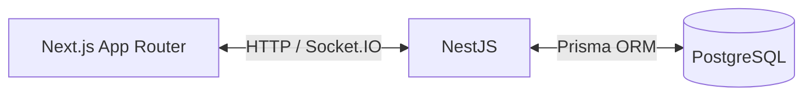
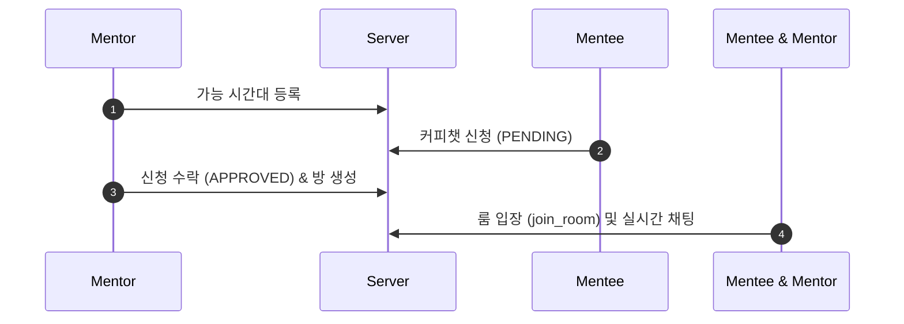

# ☕ DevBrew MVP

> **개발자 실시간 멘토-멘티 커피챗 매칭 및 채팅 플랫폼 (MVP)**
>
> 멘티의 커피챗 신청 \rightarrow 멘토 승인 \rightarrow Socket.IO 기반 1:1 실시간 채팅

------

## 🏗️ 시스템 아키텍처 & 흐름





------

## 🛠️ 핵심 API 및 소켓 이벤트

### HTTP Endpoints

- **Auth**: `POST /auth/signup` (회원가입) | `POST /auth/login` (로그인)
- **Mentor**: `GET /mentors` (목록 조회) | `GET /mentors/:id` (상세 조회)
- **TimeSlots**: `POST /time-slots` (시간 생성) | `GET /time-slots/:mentorId` (조회)
- **CoffeeChat**: `POST /coffeechats` (신청) | `PATCH /coffeechats/:id/approve` (수락)
- **Chat**: `GET /chatrooms` (룸 목록) | `GET /chatrooms/:roomId/messages` (이전 대화)

### Socket.IO Events

- **`join_room`** (클라이언트 \rightarrow 서버): 채팅방 입장 및 권한 검증
- **`send_message`** (클라이언트 \rightarrow 서버): 메시지 전송 (DB 선 저장 후 브로드캐스트)
- **`receive_message`** (서버 \rightarrow 클라이언트): 실시간 메시지 수신
- **`error`** (서버 \rightarrow 클라이언트): 에러 알림 (`UNAUTHORIZED`, `DB_ERROR` 등)

------

## 🚀 빠른 시작 (Quick Start)

### 1. 환경 변수 설정 (`.env`)

- **프론트 (`frontend/.env`)**: `NEXT_PUBLIC_API_URL=http://localhost:4000`
- **백엔드 (`backend/.env`)**: `DATABASE_URL="postgresql://..."` / `JWT_SECRET="..."`

### 2. 실행 명령 목록

Bash

```
# Backend Setup
cd backend && npm install
cp .env.example .env
npx prisma migrate dev --name init
npm run start:dev

# Frontend Setup
cd ../frontend && npm install
cp .env.example .env
npm run dev
```