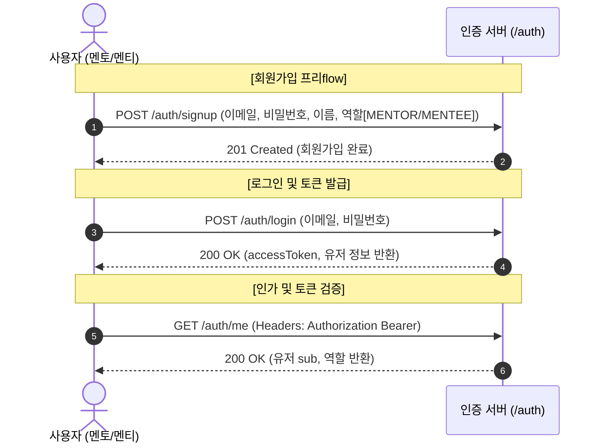
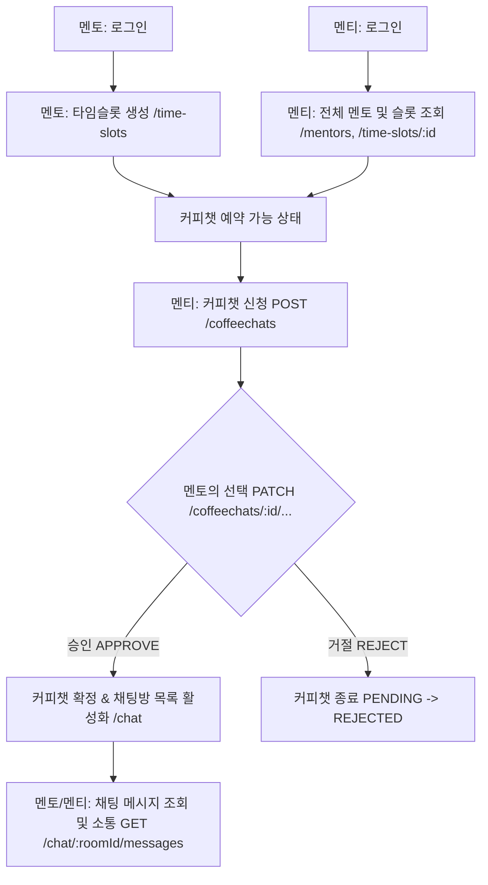
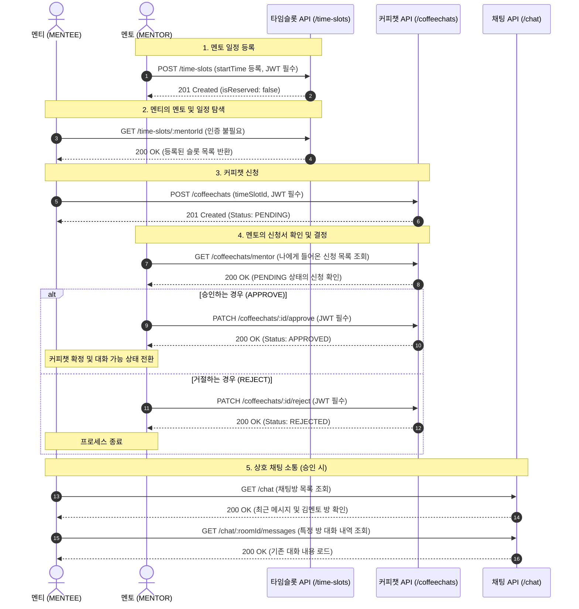

# 🚀 서비스 비즈니스 흐름 (flow.md)

본 문서는 API 명세서를 기반으로 한 멘토링 및 커피챗 서비스의 주요 비즈니스 흐름과 사용자 시나리오를 정의합니다.

------

## 1. 인증 및 사용자 관리 흐름 (Auth Flow)

모든 사용자는 서비스를 이용하기 위해 회원가입 및 로그인 과정을 거치며, 이후 권한이 필요한 API 요청 시 발급된 JWT(AccessToken)를 사용합니다.

------

## 2. 핵심 비즈니스 플로우: 커피챗 및 채팅 (Core Service Flow)

서비스의 핵심은 **[멘토의 타임슬롯 생성] ➡️ [멘티의 커피챗 신청] ➡️ [멘토의 승인/거절] ➡️ [채팅방 활성화 및 소통]** 단계로 이어집니다.

### 2.1 전체 프로세스 요약 다이어그램

### 2.2 상세 시나리오별 시퀀스 다이어그램

------